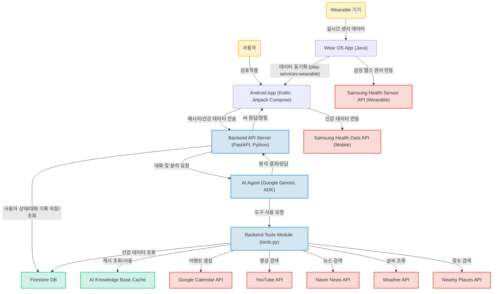

# AI 기반 웰니스 코치 (WellnessCoach)

 <!-- 로고가 있다면 추가, 없다면 삭제 -->

[](https://github.com/jaeiko/WellnessCoach-Project)

## 프로젝트 소개

본 프로젝트는 사용자 맞춤형 건강 관리를 제공하는 **AI 기반 웰니스 코치 애플리케이션**입니다. Android 모바일 앱과 Wear OS 컴패니언 앱을 통해 사용자의 건강 데이터를 통합적으로 수집하고, 이를 Google Gemini 기반의 AI 에이전트가 분석하여 개인화된 건강 코칭 및 활동 제안을 제공합니다. 사용자는 AI 코치와의 자연어 대화를 통해 운동 루틴, 식단 추천, 건강 정보, 일정 관리 등의 다양한 서비스를 받을 수 있으며, Google Calendar, YouTube 등 외부 도구와의 연동으로 더욱 확장된 경험을 제공합니다.

## 주요 기능

*   **멀티플랫폼 건강 데이터 수집**:
    *   Android 모바일 앱: 삼성 헬스 데이터(걸음 수, 심박수 등) 연동 및 대시보드 표시.
    *   Wear OS 앱: 웨어러블 기기의 센서 데이터를 실시간으로 모니터링하고 모바일 앱으로 전달.
*   **AI 기반 개인화된 코칭 및 대화**:
    *   사용자 건강 데이터, 대화 이력, 쿼리를 바탕으로 Google Gemini AI 에이전트가 맞춤형 건강 분석 및 코칭 제공.
    *   자연어 처리를 통해 사용자 질문에 응답하고, 목표 설정 및 동기 부여.
*   **외부 도구 연동을 통한 기능 확장**:
    *   **일정 관리**: Google Calendar API를 활용하여 운동, 식단 관련 일정 생성 및 관리.
    *   **정보 검색**: YouTube, Naver News API를 통해 건강 관련 영상 및 최신 뉴스 검색.
    *   **생활 편의**: 주변 장소 찾기 (예: 운동 시설, 건강식 식당), 날씨 정보 제공.
    *   **지식 기반 질의응답**: 내부 지식 베이스를 활용한 특정 건강 정보 제공.
*   **사용자 상태 및 대화 이력 관리**:
    *   Google Cloud Firestore를 사용하여 사용자 프로필, 건강 데이터, 대화 기록, AI 분석 결과 등 실시간 저장 및 관리.
    *   AI 모델의 응답 속도 향상 및 비용 절감을 위한 캐싱 시스템 활용.

## 프로젝트 구조

```
WellnessCoach-Project/
├── android-app/             # Android 모바일 및 Wear OS 앱
│   ├── app/                 # 메인 Android 모바일 애플리케이션
│   │   ├── src/
│   │   │   └── main/java/com/samsung/health/mysteps/
│   │   │       ├── presentation/ # UI 및 뷰 로직 (MainActivity.kt)
│   │   │       └── domain/       # 비즈니스 로직 및 UseCase (ReadStepDataUseCase.kt 등)
│   │   └── ...
│   └── wear/                # Wear OS 컴패니언 애플리케이션
│       └── src/main/java/com/samsung/health/multisensortracking/
│           └── MainActivity.java # 웨어러블 센서 데이터 처리
│       └── ...
├── backend-python/          # Python 기반 백엔드 AI 서버
│   ├── main.py              # AI 코어 로직 및 대화 관리 (ConversationManager)
│   ├── server.py            # FastAPI 서버 엔드포인트 및 앱 통신 처리
│   ├── multi_tool_agent/    # Google ADK 기반 AI 에이전트 및 도구 정의
│   │   ├── agent.py         # AI 에이전트 정의 (root_agent)
│   │   └── tools.py         # AI 에이전트가 활용할 외부 연동 도구들 구현
│   ├── firebase_utils.py    # Firebase Firestore 연동 유틸리티
│   ├── docs/                # AI 지식 기반으로 활용될 수 있는 문서 (추정)
│   ├── data/                # 샘플 데이터 (sample_data.json 등)
│   └── ...
└── ...
```

## 핵심 파일 설명

이 프로젝트의 핵심 파일과 그 역할은 다음과 같습니다.

1.  **`android-app/app/src/main/java/com/samsung/health/mysteps/presentation/MainActivity.kt`**: Android 앱의 진입점 역할을 하는 메인 액티비티로, 사용자 인터페이스(대시보드, 채팅 화면 등)를 구성하고 데이터를 표시하는 중심 역할을 합니다.
2.  **`android-app/app/src/main/java/com/samsung/health/mysteps/domain/*.kt`**: 삼성 헬스 데이터를 읽고 처리하는 비즈니스 로직을 캡슐화한 UseCase 파일들입니다. 예를 들어 `ReadStepDataUseCase.kt`는 걸음 수를 조회하고 가공합니다.
3.  **`android-app/wear/src/main/java/com/samsung/health/multisensortracking/MainActivity.java`**: Wear OS 컴패니언 앱의 메인 액티비티로, 웨어러블 기기의 센서 데이터를 실시간으로 모니터링하고 처리하는 로직을 담당합니다.
4.  **`backend-python/main.py`**: 백엔드 AI 코어 로직을 담고 있는 파일입니다. 사용자 쿼리, 건강 데이터, 대화 이력을 바탕으로 AI 에이전트를 실행하고, 사용자의 상태를 관리하며, 최종 AI 응답을 생성하는 역할을 합니다. `ConversationManager` 클래스가 AI 에이전트와의 상호작용 및 Firebase 연동을 관리합니다.
5.  **`backend-python/server.py`**: FastAPI를 사용하여 Android 앱과의 통신을 처리하는 백엔드 서버의 메인 엔드포인트 파일입니다. 앱으로부터의 모든 채팅 및 데이터 요청을 받아 `main.py`의 AI 로직으로 전달하고, AI의 응답을 앱으로 반환합니다. 사용자 데이터 부족 시 설문지를 요청하거나, AI 응답에 따른 사용자 상태 변경을 처리하는 로직을 포함합니다.
6.  **`backend-python/multi_tool_agent/agent.py`**: Google ADK `Agent`를 정의하는 파일입니다. `root_agent`라는 핵심 AI 에이전트를 생성하고, `tools.py`에 정의된 모든 외부 연동 도구들을 이 에이전트에 연결하여 AI가 다양한 기능을 수행할 수 있도록 합니다.
7.  **`backend-python/multi_tool_agent/tools.py`**: AI 에이전트가 활용할 수 있는 다양한 외부 연동 도구들을 구현한 파일입니다. `get_health_data`, `Youtube`, `google_calendar_create_single_event`, `find_nearby_places`, `ask_knowledge_base` 등 AI의 기능을 확장하는 핵심 도구 함수들이 정의되어 있습니다.
8.  **`backend-python/firebase_utils.py`**: Firebase Firestore 데이터베이스와의 연동을 처리하는 유틸리티 파일입니다. 사용자 프로필 조회, 대화 기록 저장, AI 분석 결과 저장, 사용자 상태 업데이트 등 모든 데이터베이스 상호작용을 담당합니다.

## 기술 스택 및 선택 이유

### Frontend

*   **Kotlin (2.2.0)**: 간결하고 안전한 언어로 Android 앱 개발 생산성을 높이고, 현대적인 UI를 구축하는 데 유리합니다.
*   **Android SDK (AGP 8.12.1)**: Android 플랫폼의 광범위한 기능을 활용하여 다양한 기기에서 동작하는 앱을 개발할 수 있는 기반을 제공합니다.
*   **Jetpack Compose (BOM 2025.07.00)**: 선언형 UI 패러다임을 사용하여 UI 개발 속도를 향상시키고, 더 예측 가능한 상태 관리를 가능하게 합니다.
*   **Wear OS (play-services-wearable 18.0.0)**: 스마트워치와 같은 웨어러블 기기용 앱을 개발하여 사용자의 건강 데이터를 실시간으로 수집하고 연동하는 경험을 확장합니다.
*   **Samsung Health SDK (samsung-health-data-api, samsung-health-sensor-api)**: 삼성 헬스와 연동하여 걸음 수, 심박수 등 정확하고 신뢰할 수 있는 건강 데이터를 앱으로 가져올 수 있습니다.
*   **Hilt (2.57) (Dagger Hilt)**: 의존성 주입을 통해 코드의 모듈성과 테스트 용이성을 높여, 대규모 Android 앱의 유지보수를 효율적으로 만듭니다.
*   **Gson (2.13.1)**: JSON 데이터를 Java/Kotlin 객체로 쉽게 변환하거나 그 반대로 변환하여, 백엔드와의 데이터 통신을 간편하게 처리합니다.

### Backend

*   **Python**: 다양한 라이브러리와 프레임워크를 활용하여 AI, 데이터 처리, 웹 서비스 등 다목적 백엔드 시스템을 빠르게 개발할 수 있습니다.
*   **FastAPI**: 고성능 비동기 웹 프레임워크로, Python 타입 힌트를 활용하여 API 문서를 자동으로 생성하고 개발 속도를 높일 수 있습니다.
*   **Google Generative AI SDK (Gemini)**: Google의 최신 대규모 언어 모델인 Gemini를 활용하여 복잡한 사용자 쿼리를 이해하고 지능적인 응답을 생성하는 AI 기능을 쉽게 통합할 수 있습니다.
*   **Google ADK (Agent Development Kit)**: AI 에이전트의 개발과 관리를 용이하게 하여, 툴 사용, 상태 관리 등 복잡한 AI 로직을 구조화하고 확장 가능하게 만듭니다.
*   **Firebase Admin SDK**: 백엔드에서 Firebase 서비스를 안전하게 제어하고, 사용자 데이터, 인증, 알림 등 다양한 기능을 손쉽게 관리할 수 있습니다.
*   **python-dotenv**: 환경 변수를 코드와 분리하여 관리함으로써 보안을 강화하고, 개발 및 배포 환경 설정을 유연하게 처리할 수 있습니다.

### Database

*   **Google Cloud Firestore**: NoSQL 클라우드 데이터베이스로, 실시간 동기화 기능을 제공하여 앱의 데이터를 빠르고 유연하게 저장하고 관리할 수 있습니다.
*   **Google Generative AI Cache**: AI 모델의 응답 속도를 향상시키고 비용을 절감하기 위해 자주 사용되는 정보나 처리 결과를 캐싱하여 활용할 수 있습니다.

### DevOps

*   **Git**: 분산 버전 관리 시스템으로, 협업 개발 환경에서 코드 변경 사항을 효율적으로 추적하고 관리하여 프로젝트의 안정성을 높입니다.
*   **Firebase Platform**: 인증, 데이터베이스, 스토리지 등 다양한 백엔드 서비스를 제공하여 개발자가 인프라 관리에 드는 시간을 줄이고 핵심 기능 개발에 집중할 수 있게 합니다.

## 시스템 아키텍처

이 프로젝트는 AI 기반의 웰니스 코치 애플리케이션으로, 크게 Android 기반의 모바일/웨어러블 클라이언트와 Python 기반의 백엔드 AI 서버로 구성됩니다. 사용자는 Android 앱을 통해 건강 데이터를 입력하고 AI 코치와 대화하며 맞춤형 건강 관리 서비스를 받습니다. Wear OS 앱은 삼성 헬스 센서와 연동하여 실시간 데이터를 수집하고 이를 모바일 앱으로 전달합니다. 백엔드 서버는 FastAPI로 구현되어 사용자의 요청을 처리하고, Google Gemini AI 에이전트를 활용하여 건강 데이터를 분석하고, Google Calendar, YouTube, Naver News 등 다양한 외부 도구와 연동하여 사용자에게 맞춤형 루틴 제안, 정보 검색, 이벤트 등록 등의 지능적인 서비스를 제공합니다. 모든 사용자 데이터 및 대화 기록, AI 분석 결과는 Google Cloud Firestore에 저장되어 관리됩니다.



## 실행 방법

추가 작성 필요: 프로젝트 실행을 위한 구체적인 설정 및 빌드/실행 지침 (예: 환경 변수 설정, 종속성 설치, 빌드 명령어 등)이 필요합니다.

## 개선 방향

본 프로젝트는 다음과 같은 방향으로 추가 개선 및 발전될 수 있습니다.

1.  **Firebase 자격 증명 관리 명확화**: `firebase_credentials.json` 파일의 안전한 관리 및 배포 환경 설정을 위한 명확한 가이드라인 (예: Google Cloud Secret Manager 연동)을 수립해야 합니다.
2.  **AI 지식 기반 (RAG) 활용 메커니즘 구체화**: `docs` 폴더 내 문서들이 AI 모델의 `ask_knowledge_base` 툴로 활용되는 방식을 구체적으로 명시하고, 지식 베이스 업데이트 및 관리 프로세스를 최적화해야 합니다. (추정: `create_cache.py`를 통해 Google Generative AI 캐시로 활용)
3.  **Wear OS-모바일 앱 데이터 통신 최적화**: Wear OS 앱과 메인 Android 앱 간의 실시간 센서 데이터 동기화 및 전송 메커니즘을 `Wearable Data Layer API` 등의 구체적인 방법을 명시하고 안정성을 확보해야 합니다.
4.  **AI 응답 JSON 형식 규격화 및 안정성 강화**: `server.py`에서 AI의 JSON 응답 형식을 파싱하는 로직이 있으므로, AI 모델이 항상 예상된 형식으로 응답을 생성하도록 프롬프트 엔지니어링을 더욱 강화하고, 파싱 실패 시의 오류 처리 로직을 보강해야 합니다.
5.  **`sample_data.json`의 역할 정의**: `backend-python/data/sample_data.json`이 개발/테스트용 임시 데이터인지, 아니면 실제 운영에서 사용될 기본 데이터인지 명확히 정의하고, 프로덕션 환경에서의 사용 여부를 결정해야 합니다.
6.  **테스트 코드 도입**: 단위 테스트 및 통합 테스트를 작성하여 코드의 안정성과 신뢰성을 높여야 합니다.
7.  **CI/CD 파이프라인 구축**: 지속적인 통합 및 배포(CI/CD) 파이프라인을 구축하여 개발 효율성을 증대하고 배포 과정을 자동화해야 합니다.
8.  **성능 최적화**: AI 응답 속도, 앱 로딩 시간 등 전반적인 시스템 성능 최적화를 위한 벤치마킹 및 개선 작업을 진행할 수 있습니다.
9.  **보안 강화**: API 키 관리, 사용자 데이터 암호화 등 전반적인 보안 취약점 점검 및 강화 작업을 수행해야 합니다.